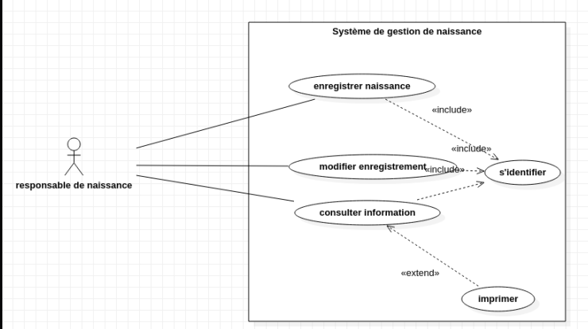
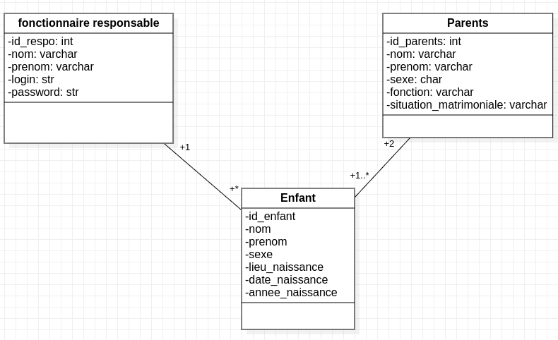

# projett
Conception-et-r-alisation-d-une-base-de-donn-es-pour-l-enregistrement-des-naissances-en-utilisant-Py
Mettre sur pied une base de données pour l’enregistrement des naissances en utilisant Python et MySQL.
https://python.antoinepernot.fr/cours.php?course=chap6
## concept
Le système à mettre en place sera développé avec le langage Python. Il permettra à un fonctionnaire en charge de déclaration des naissances à l’hôpital d'entrer les informations d’un (e) nouveau (elle) né(e)  (id, nom, prénom, nom du père, situation matrimoniale du père, fonction du père, nom de la mère, situation matrimoniale de la mère, fonction de la mère, sexe de l’enfant, lieu de naissance, date et année de naissance) afin de garder une trace numérique de tous les nouveaux nés.

## Diagramme de classe

## Diagramme de classe

## A propos des auteurs
<a href="https://github.com/AdoumGrene21"> Adoum ahmat GRENE</a>

<a href="https://github.com/Mbaitelsem"> Mbaitelsem Miakakem</a>

<a href="https://github.com/Mallaimy"> Abakar Mahamat Mallah (aslias Mallaimy) </a>

<a href="https://github.com/fredifils"> FREDERIC DANIMBE</a>

